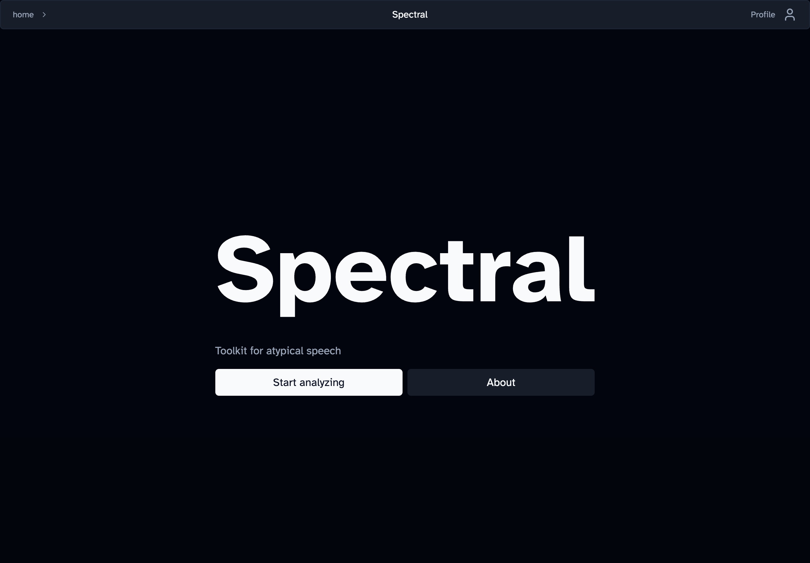
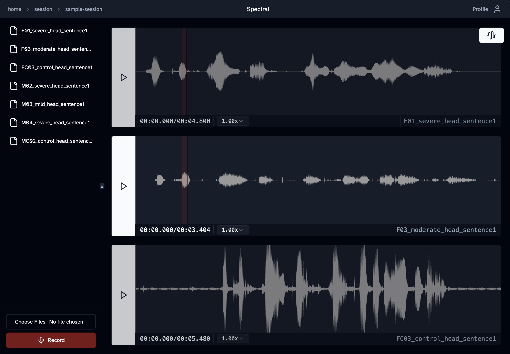

# Spectral

TODO: Add badges

Spectral is a toolkit that enables comparative analysis of atypical speech, with a nice user experience.

It is designed to be modular and extensible.

<!--toc:start-->
  - [Usage](#usage)
    - [Running locally](#running-locally)
    - [Self hosting](#self-hosting)
  - [Contributing](#contributing)
  - [License](#license)
<!--toc:end-->




## Usage

The easiest way to use the app is by accessing at https://spectral.ewi.tudelft.nl.

### Running locally

First, clone the repo:

```bash
git clone https://github/TBD/spectral.git
cd spectral
```

Download [Docker](TODO) and [Docker compose](TODO) following the instructions on the website.

(NOTE: For MacOS (especially Apple Sillicon), consider using [colima](TODO) as the runtime)

Then, run the compose file

```
docker compose up --build
```

This will pull the containers and install all dependencies. (NOTE: There is one Python dependency where wheels have to be rebuilt. This will likely take 5-10 minutes at least).

When all the containers are pulled and the dependencies built, the app should be available at `localhost` (i.e., `http://localhost:80`).

### Self hosting

Spectral can be easily self-hosted on your own server.

Follow the steps above and expose port 80. You could also change the nginx config to host the app in a different port. That is, in `nginx.conf` change the "listen 80;" line to your desired port:

```diff
...

server {
-    listen 80;
+    listen <YOUR-PORT>;

    ...
}

...
```

<details>

<summary> If you really don't want two reverse proxies... </summary>

For more advanced users, if you are already using a reverse proxy then you can follow the configuration in the docker compose file and set up each service in your configuration.

For example, if you're already using compose then you can add the services with barely any changes to your existing compose file. This method as-explained is somewhat dubious fundamentally, but an advanced user can figure it out. Again, this is not really recommended nor officially supported by the project.

</details>

## Contributing

Contributions are welcomed. For more information, see the [CONTRIBUTING.md](/CONTRIBUTING.md)

## License

TODO
